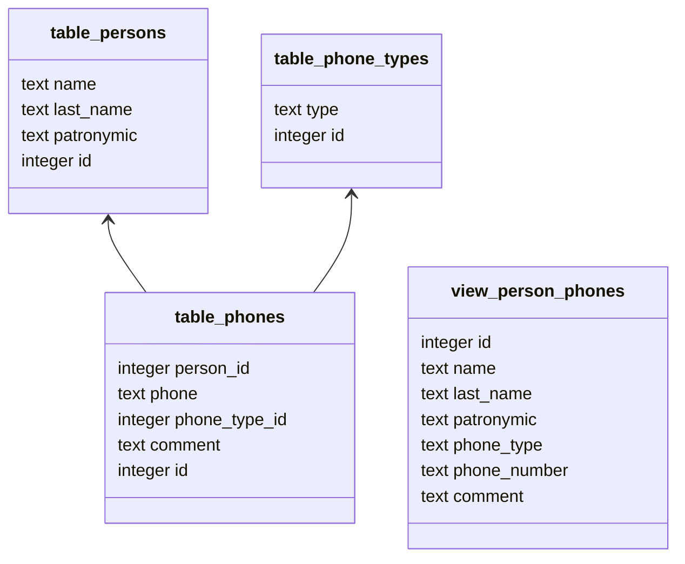

# Телефонная книга

## Задание

Создать графическое приложение для телефонной книги.
Данные хранятся в БД. Приложение на WPF.

Что умеет приложение:
- добавление контакта
- редактирование контакта
- удаление контакта
- поиск контактов по имени
- поиск контактов по телефону
- вывод всех контактов
- выгрузка контактов
- загрузка контактов

Что использует программа:
- PostgreSQL
- ADO.Net + Dapper
- WPF (MVVM)
- слоистая архитектура

Из чего состоит `контакт`:
- Фамилия, Имя, Отчество
- телефон: тип, номер
- комментарий

## БД

